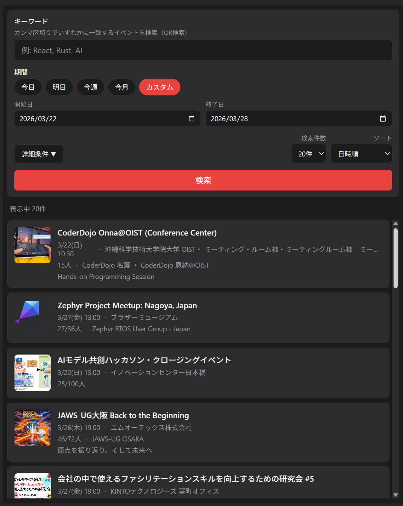
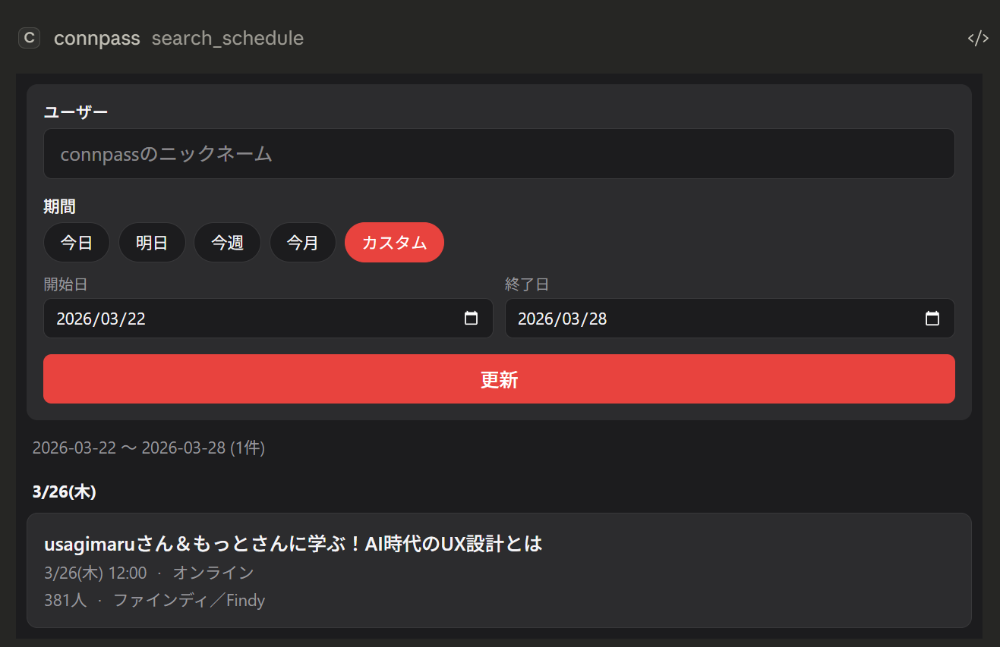
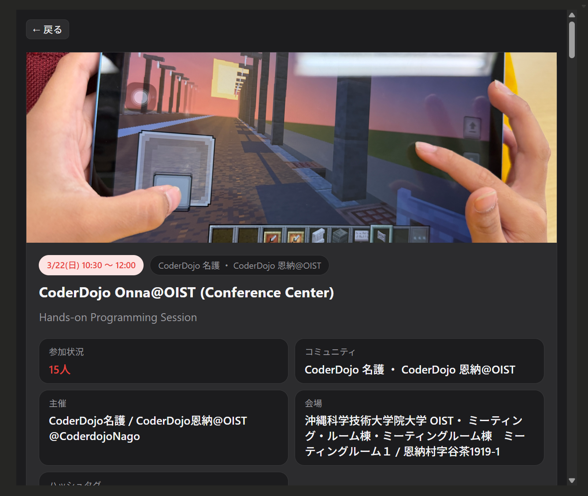

# Connpass MCP Server

[](https://www.npmjs.com/package/@kajidog/connpass-mcp-server)

Connpass の API を MCP (Model Context Protocol) 経由で利用するためのツール群です。AI エージェントや LLM が Connpass のイベント・グループ・ユーザー情報を自然言語に近い入力で取得できます。

## できること

- **イベント検索**: 日付（YYYY-MM-DD 形式）やキーワードでイベントを検索
- **イベント詳細**: イベント ID を指定して説明文・発表情報をフル取得
- **スケジュール検索**: ユーザーの参加予定イベントを日付別に表示
- **ユーザー情報取得**: ニックネームやユーザー ID でユーザー情報を検索
- **グループ情報取得**: キーワードや所在地でグループを検索
- **参加イベント管理**: 特定ユーザーの参加予定・過去参加・登壇イベントを取得
- **発表情報取得**: イベントの発表セッション詳細を取得
- **MCP Apps 対応**: インタラクティブなイベントブラウザ UI を表示可能

### MCP Apps 対応

MCP Apps Extension 対応クライアントでは、リッチなインタラクティブ UI が利用できます。

<div align="center">
  
  <p><em>イベント検索結果を表示</em></p>
</div>

<div align="center">
  
  <p><em>スケジュール検索：タイトルクリックでConnpassへ直接移動</em></p>
</div>

<div align="center">
  
  <p><em>イベント詳細：セッション情報や主催者情報を確認</em></p>
</div>

## クイックセットアップ

### stdio モードで起動（Claude Desktop など）

```bash
# 起動
npx @kajidog/connpass-mcp-server

# API キーを指定
CONNPASS_API_KEY=your-api-key npx @kajidog/connpass-mcp-server

# ヘルプを表示
npx @kajidog/connpass-mcp-server --help
```

### HTTP モードで起動

```bash
npx @kajidog/connpass-mcp-server --http --port 3000
```

### 必要要件

- Node.js 18 以上
- pnpm 9 以上（開発の場合）
- Docker & Docker Compose（Docker 利用の場合）

### Docker で起動

```bash
# .env ファイルを作成
cp .env.example .env
# .env ファイルを編集して CONNPASS_API_KEY を設定

# Docker Compose で起動
docker compose up -d

# ログを確認
docker compose logs -f
```

サーバーは `http://localhost:3000/mcp` で HTTP モードとして起動します。

## ディレクトリ構成

```
connpass-in-chatgpt/
├── apps/
│   └── mcp-server/            # MCP サーバー (MCP Apps Extension 版)
│       └── src/
│           ├── tools/          # MCP ツール定義 (events, users, groups)
│           │   ├── utils/      # ユーティリティ (formatting, shared, types)
│           │   └── ui-tools/   # UI 内部ツール
│           └── config.ts       # サーバー設定
│
├── packages/
│   ├── api-client/             # Connpass API クライアント (TypeScript)
│   ├── connpass-ui/            # インタラクティブ UI コンポーネント (React)
│   └── mcp-core/               # MCP コア SDK (stdio/HTTP, config)
│
├── Dockerfile                   # Docker イメージ定義
├── docker-compose.yml           # Docker Compose 設定
├── .env.example                 # 環境変数のサンプル
├── pnpm-workspace.yaml          # pnpm ワークスペース設定
└── package.json                 # ルートパッケージ設定
```

## 環境変数

| 変数名 | 説明 | デフォルト |
|--------|------|-----------|
| `CONNPASS_API_KEY` | Connpass API キー | - |
| `CONNPASS_DEFAULT_USER_ID` | スケジュール検索のデフォルトユーザー ID | - |
| `CONNPASS_RATE_LIMIT_ENABLED` | API レート制限の有効化 | `true` |
| `CONNPASS_RATE_LIMIT_DELAY_MS` | レート制限の遅延 (ms) | `1000` |
| `MCP_HTTP_MODE` | HTTP モードで起動 | `false` |
| `MCP_HTTP_PORT` | HTTP モードのポート | `3000` |
| `MCP_HTTP_HOST` | HTTP モードのホスト | `0.0.0.0` |
| `MCP_API_KEY` | HTTP モードの API キー認証 | - |

## 開発

```bash
# 依存関係をインストール
pnpm install

# 全パッケージをビルド
pnpm build

# 型チェック
pnpm typecheck

# 開発モードで起動
pnpm dev
```

## ライセンス

MIT
