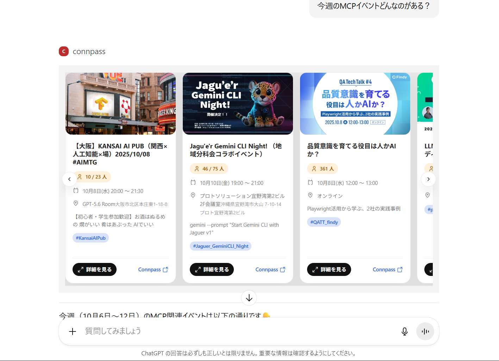
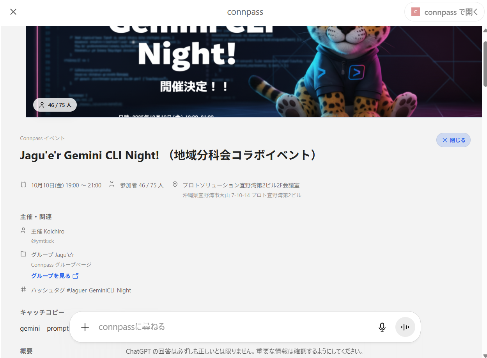

# Connpass MCP Server

[](https://www.npmjs.com/package/@kajidog/connpass-mcp-server)

Connpass の API を MCP (Model Context Protocol) 経由で利用するためのツール群です。AI エージェントや LLM が Connpass のイベント・グループ・ユーザー情報を自然言語に近い入力で取得できます。

## できること

- **イベント検索**: 自然言語の日付表現（`today`, `next Monday` など）やキーワードでイベントを検索
- **ユーザー情報取得**: ニックネームやユーザー ID でユーザー情報を検索
- **グループ情報取得**: キーワードや所在地でグループを検索
- **参加イベント管理**: 特定ユーザーの参加予定・過去参加・登壇イベントを取得
- **発表情報取得**: イベントの発表セッション詳細を取得
- **OpenAI Apps SDK 対応**: カルーセル形式でイベントを表示し、詳細画面でセッション情報を確認可能

### OpenAI Apps SDK 対応

`CONNPASS_ENABLE_APPS_SDK_OUTPUT=true` を設定すると、ChatGPT などの OpenAI Apps SDK 対応クライアントでリッチなウィジェット表示が可能になります。

<div align="center">
  
  <p><em>イベント検索結果をカルーセル形式で表示</em></p>
</div>

<div align="center">
  
  <p><em>今日と今後のイベントをリスト形式で表示</em></p>
</div>

<div align="center">
  
  <p><em>詳細ボタンでセッション情報や主催者情報を確認</em></p>
</div>

## デプロイ方法

### Cloudflare Workers（推奨）

エッジで高速に動作するサーバーレスデプロイ。詳細は [packages/cloudflare-worker/README.md](packages/cloudflare-worker/README.md) を参照してください。

```bash
cd packages/cloudflare-worker
pnpm deploy
```

### ローカル環境

## クイックセットアップ

### npx で即座に起動

```bash
# HTTP トランスポートで起動（デフォルト）
npx @kajidog/connpass-mcp-server

# ポート指定
npx @kajidog/connpass-mcp-server --port 8080

# SSE トランスポートで起動
npx @kajidog/connpass-mcp-server --transport sse

# ヘルプを表示
npx @kajidog/connpass-mcp-server --help
```

環境変数を設定する場合：

```bash
CONNPASS_API_KEY=your-api-key npx @kajidog/connpass-mcp-server
```

### グローバルインストール

```bash
# インストール
npm install -g @kajidog/connpass-mcp-server

# 実行
connpass-mcp-server
```

### 必要要件

- Node.js 18 以上
- pnpm 8 以上（開発・通常インストールの場合）
- Docker & Docker Compose（Docker 利用の場合）

### Docker で起動

```bash
# .env ファイルを作成
cp .env.example .env
# .env ファイルを編集して CONNPASS_API_KEY を設定

# Docker Compose で起動
docker-compose up -d

# ログを確認
docker-compose logs -f
```

サーバーは `http://localhost:3000` で起動します。

### トランスポート方式と接続URL

MCP サーバーは以下の2つのトランスポート方式に対応しています。

#### HTTP (Streamable HTTP) - デフォルト

```bash
# デフォルトで HTTP トランスポートで起動
pnpm --filter @kajidog/connpass-mcp-server start

# ポート指定
pnpm --filter @kajidog/connpass-mcp-server start -- --port 8080
```

- **接続URL**: `http://localhost:3000` (デフォルト)
- MCPクライアントから `POST http://localhost:3000` でリクエストを送信します

#### SSE (Server-Sent Events)

```bash
# SSE トランスポートで起動
pnpm --filter @kajidog/connpass-mcp-server start -- --transport sse

# ポート指定
pnpm --filter @kajidog/connpass-mcp-server start -- --transport sse --port 8080
```

- **接続URL**: `http://localhost:3000/mcp` (デフォルト)
- SSE ストリーム: `GET http://localhost:3000/mcp`
- メッセージ送信: `POST http://localhost:3000/mcp/messages?sessionId=...`

詳細は [packages/mcp-server/README.md](packages/mcp-server/README.md) のトランスポート方式セクションを参照してください。

### 通常インストール

```bash
# 依存関係をインストール
pnpm install

# ビルド
pnpm build

# 環境変数を設定して起動
cp .env.example .env
# .env ファイルを編集

# MCP サーバーを起動
pnpm --filter @kajidog/connpass-mcp-server start
```

環境変数の詳細は [packages/mcp-server/README.md](packages/mcp-server/README.md) を参照してください。

## ディレクトリ構成

```
connpass-in-chatgpt/
├── packages/
│   ├── api-client/          # Connpass API クライアント（TypeScript）
│   │   ├── src/             # API クライアントのソースコード
│   │   ├── dist/            # ビルド成果物
│   │   └── README.md        # API クライアントの詳細ドキュメント
│   │
│   └── mcp-server/          # MCP サーバー実装
│       ├── src/             # MCP サーバーのソースコード
│       │   ├── tools/       # MCP ツール定義（events, users, groups など）
│       │   ├── widgets/     # OpenAI Apps SDK 用ウィジェット
│       │   └── transports/  # SSE トランスポート実装
│       ├── dist/            # ビルド成果物
│       └── README.md        # MCP サーバーの詳細ドキュメント
│
├── docs/                    # その他ドキュメント
├── data/                    # キャッシュデータ保存先（Docker volume）
├── Dockerfile               # Docker イメージ定義
├── docker-compose.yml       # Docker Compose 設定
├── .env.example             # 環境変数のサンプル
├── pnpm-workspace.yaml      # pnpm ワークスペース設定
└── package.json             # ルートパッケージ設定
```

## パッケージ詳細

### @kajidog/connpass-api-client

Connpass API v2 の TypeScript クライアントライブラリ。
詳細は [packages/api-client/README.md](packages/api-client/README.md) を参照。

### @kajidog/connpass-mcp-server

MCP 経由で Connpass API を利用するためのサーバー実装。
詳細は [packages/mcp-server/README.md](packages/mcp-server/README.md) を参照。

## 開発

```bash
# 全パッケージをビルド
pnpm build

# 型チェック
pnpm typecheck

# ウォッチモードで開発
pnpm dev
```

## ライセンス

MIT
